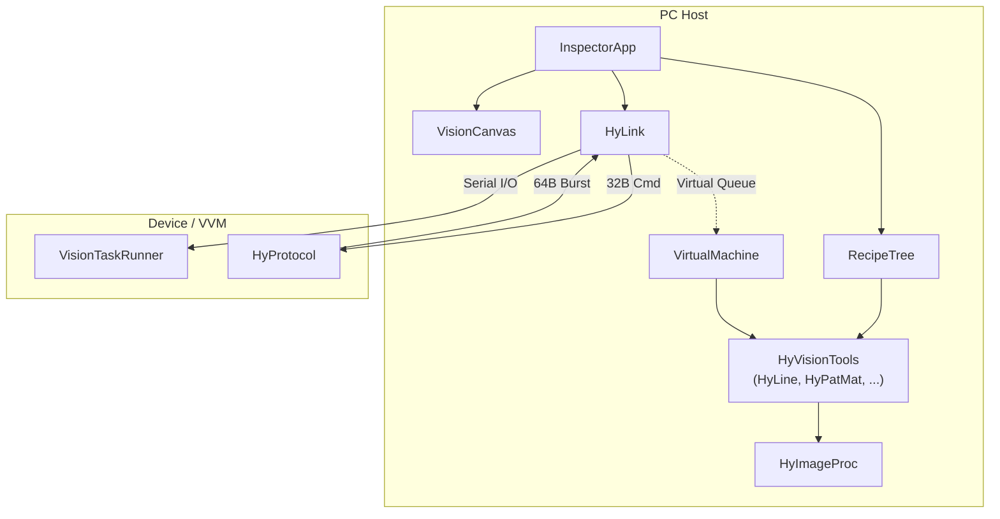

# 클래스 및 모듈 명세서 (Class & Module Specification)

**버전:** 2.0 (마스터 상세서 v4.3, 프로토콜 명세서 v2.0 동기화)
**최종 수정:** 2026-04-14

---

## 1. 네이밍 정책 및 모듈 구조

### 1.1. 네이밍 원칙

| 원칙 | 규칙 | 예시 |
|------|------|------|
| **접두어** | 모든 도메인 클래스에 `Hy` 접두어 부여 (브랜드 네임스페이스) | `HyLine`, `HyProtocol` |
| **파일명** | 모듈의 역할을 포괄적·간결하게 반영. `_PC` / `_FW` 접미어로 실행 환경 구분 | `HyVisionTools.py`, `HyLink.py` |
| **클래스명** | PascalCase, 역할 중심의 직관적 이름 | `InspectorApp`, `VisionCanvas` |
| **변수/필드** | snake_case, 프로토콜 필드명과 1:1 매칭 | `rst_done`, `cycle_id`, `tool_id` |

### 1.2. 모듈 맵 (파일 구성)

```
HyVision_HD_PY/
├── InspectorApp.py          # [PC] 메인 윈도우 (구 MainWindow.py)
├── VisionCanvas.py          # [PC] 비전 뷰포트 위젯 (구 VisionMap.py)
├── HyLink.py                # [PC] 장치 통신 워커 스레드 (구 OpenMVWorker.py)
├── HyProtocol.py            # [공통] 32B/64B 패킷 Pack/Unpack (PC·FW 양방향 호환)
├── HyVisionTools.py         # [PC] OpenCV 기반 비전 툴 라이브러리 (구 PCVisionTools.py)
├── HyImageProc.py           # [PC] 이미지 전처리 엔진 (구 PCVisionEngine.py)
├── VirtualMachine.py        # [PC] 가상 비전 머신(VVM) 스레드
├── RecipeTree.py            # [PC] DCOM 집행관 트리 및 레시피 관리
├── OverlayPanel.py          # [PC] 설정 패널 오버레이 위젯 (구 OverlayConfigPanel.py)
├── StatusIndicator.py       # [PC] 연결 상태 LED (구 StatusLED.py)
├── PlatformUtil.py          # [PC] OS 유틸리티 (구 WinUtil.py + DismountOpenMV.py)
└── firmware/
    └── FirmwareMain.py      # [FW] 장치 측 메인 루프 및 VisionTaskRunner
```

### 1.3. 레거시 → 신규 이름 매핑 (마이그레이션 가이드)

| 레거시 파일명 | 레거시 클래스명 | 신규 파일명 | 신규 클래스명 | 변경 사유 |
|--------------|---------------|-----------|-------------|----------|
| `MainWindow.py` | `MainWindow` | `InspectorApp.py` | `InspectorApp` | "메인 윈도우"는 관용적이나 역할 불명확. "검사기"라는 도메인 정체성 부여 |
| `VisionMap.py` | `VisionMap` | `VisionCanvas.py` | `VisionCanvas` | "Map"은 지도를 연상. "Canvas"가 화면 렌더링 표면으로서 더 직관적 |
| `OpenMVWorker.py` | `OpenMVWorker` | `HyLink.py` | `HyLink` | 장치 브랜드(OpenMV) 종속 탈피, 물리/가상 연결 모두 포괄 |
| `PCVisionEngine.py` | `PCVisionEngine` | `HyImageProc.py` | `HyImageProc` | "Engine"은 과대. 실제로는 전처리(블러, 감마, 모폴로지) 유틸리티 |
| `PCVisionTools.py` | `BaseVisionTool_PC`, `HyLine_PC` 등 | `HyVisionTools.py` | `HyTool`, `HyLine` 등 | `_PC` 접미어 제거 — 모듈 파일 자체가 PC 컨텍스트이므로 중복 |
| `OverlayConfigPanel.py` | `OverlayConfigPanel` | `OverlayPanel.py` | `OverlayPanel` | 불필요한 `Config` 제거 |
| `StatusLED.py` | `StatusLED` | `StatusIndicator.py` | `StatusIndicator` | LED 물리 장치가 아닌 소프트웨어 표시 위젯이므로 "Indicator"가 정확 |
| `WinUtil.py` | `WinUtil` | `PlatformUtil.py` | `PlatformUtil` | Windows 종속 이름 탈피, 크로스 플랫폼 확장 대비 |
| (신규) | — | `VirtualMachine.py` | `VirtualMachine` | VVM 설계서(0.1)의 가상 비전 머신 스레드 |
| (신규) | — | `RecipeTree.py` | `RecipeTree` | 단순 dict 목록 → 계층적 집행관 트리 격상 |

---

## 2. 공통 프로토콜 계층 (`HyProtocol.py`)

```python
class HyProtocol:
    """32B/64B 고정 길이 패킷의 Pack/Unpack.
    PC(CPython)와 Device(MicroPython) 양방향 호환."""
```

### Properties (클래스 상수)

| 상수명 | 값 | 설명 |
|--------|-----|------|
| `CMD_FORMAT` | `"<H B B 4i I 8x"` | 32B Command Struct 포맷 |
| `CMD_SIZE` | `32` | Command Struct 고정 크기 |
| `CMD_SYNC` | `0xBB66` | Command 동기화 헤더 |
| `RST_FORMAT` | `"<H I I I H H H B B 5f 4f I 2x"` | 64B Result Struct 포맷 |
| `RST_SIZE` | `64` | Result Struct 고정 크기 |
| `RST_SYNC` | `0xAA55` | Result 동기화 헤더 |

### Enum 상수

| 카테고리 | 상수명 | 값 | 설명 |
|---------|--------|-----|------|
| rst_done | `EXEC_IDLE` | `0` | 미실행/스킵 |
| rst_done | `EXEC_DONE` | `1` | 정상 완료 |
| rst_done | `EXEC_ERROR` | `2` | 에러 발생 |
| rst_done | `EXEC_PENDING` | `3` | 진행 중 / 대기 |
| rst_state | `JUDGE_NG` | `0` | NG / False |
| rst_state | `JUDGE_OK` | `1` | OK / True |
| rst_state | `JUDGE_PENDING` | `2` | 미확정 (Pending) |

### Methods

| 메서드 | 시그니처 | 설명 |
|--------|---------|------|
| `pack_command` | `@staticmethod pack_command(cmd_id, target_id, params, payload_len=0) → bytes` | 32B Command 패킹 |
| `unpack_command` | `@staticmethod unpack_command(data: bytes) → dict \| None` | 32B Command 언패킹 |
| `pack_result` | `@staticmethod pack_result(tx_id, cycle_id, img_id, ..., proc_time) → bytes` | 64B Result 패킹 |
| `unpack_result` | `@staticmethod unpack_result(data: bytes) → dict \| None` | 64B Result 언패킹 |

---

## 3. 비전 툴 계층 (`HyVisionTools.py`)

### 3.1. `HyTool` — 추상 기본 클래스

```python
class HyTool(ABC):
    """모든 비전 툴의 공통 인터페이스.
    DCOM 트리의 리프 노드이자, 결과 패킷의 데이터 소스."""
```

#### Properties

| 속성 | 타입 | 설명 |
|------|------|------|
| `tool_id` | `int` | 툴 고유 식별자 (1-based) |
| `seq_id` | `int` | 트리 내 실행 순서 |
| `tool_type` | `int` | 툴 종류 코드 (§2.4 프로토콜 명세서 참조) |
| `device_id` | `int` | 연산 수행 주체 (1: Device, 2: PC) |
| `search_roi` | `tuple[int,int,int,int]` | 탐색 영역 `(x, y, w, h)` |
| `use_anchor` | `bool` | 단일 마스터 앵커(`HyLocator`) 추종 여부 |
| `parent_id` | `int` | 트리 상의 부모 노드 ID (0이면 루트) |
| `rst_done` | `int` | 실행 상태 (EXEC_IDLE / DONE / ERROR / PENDING) |
| `rst_state` | `int` | 논리 판정 (JUDGE_NG / OK / PENDING) |
| `x, y, w, h, angle` | `float` | 결과 좌표 및 기하 |
| `stat1~4` | `float` | 다목적 통계치 (Score, 편차 등) |
| `proc_time` | `int` | 연산 소요 시간 (ms) |

#### Methods

| 메서드 | 시그니처 | 설명 |
|--------|---------|------|
| `execute` | `execute(img, img_id, cycle_id) → bool` | 연산 수행 (캐싱 포함). 알고리즘 호출 후 rst_done 반환 |
| `_run` | `@abstractmethod _run(img) → None` | 서브클래스가 오버라이드하는 실제 알고리즘 |
| `to_packet` | `to_packet(tx_id, cycle_id, img_id) → bytes` | 64B Result 패킷 직렬화 |
| `from_packet` | `from_packet(data: dict) → None` | Result dict로부터 상태 역직렬화 (State Injection) |

---

### 3.2. 물리 비전 툴 (Physical Vision Tools)

#### `HyLine` — 엣지 프로파일 기반 선 추출

```python
class HyLine(HyTool):
    """5-Split 밴드 프로파일링 + 최소자승 회귀로 직선 추출.
    midpoint_check로 노이즈 밴드 방어."""
```

| 고유 속성 | 타입 | 기본값 | 설명 |
|-----------|------|--------|------|
| `num_splits` | `int` | `5` | 수평 분할 수 |
| `cut_ratio` | `float` | `0.55` | 피크 판별 임계비 |
| `mid_check` | `bool` | `False` | 중간점 밝기 검증 활성화 |
| `mid_ratio` | `float` | `0.7` | 중간점 임계 비율 |
| `scan_dir` | `int` | `0` | 스캔 방향 (0: 상→하, 1: 하→상) |
| `peak_mode` | `int` | `0` | 피크 위치 결정 (0: 중앙, 1: 시작단, 2: 끝단) |

**결과 매핑:** `x` = 선 중앙 X, `y` = 선 중앙 Y, `angle` = 기울기(도), `stat1` = 최대 임계값

#### `HyPatMat` — NCC 기반 템플릿 매칭

```python
class HyPatMat(HyTool):
    """OpenCV cv2.matchTemplate(TM_CCOEFF_NORMED) 기반 NCC 매칭.
    다단계(L0→L1→L2→Full) 피라미드 탐색."""
```

| 고유 속성 | 타입 | 기본값 | 설명 |
|-----------|------|--------|------|
| `templates` | `dict[int, ndarray]` | — | 스케일별 템플릿 이미지 (0:L0, 1:L1, 2:L2, 3:Full) |
| `th_scan` | `float` | `0.10` | L0 스캔 임계값 |
| `th_find` | `float` | `0.50` | 정밀 매칭 임계값 |

**결과 매핑:** `x, y` = 매칭 중심 좌표, `w, h` = 템플릿 크기, `stat1` = NCC Score

#### `HyLocator` — 단일 마스터 앵커

```python
class HyLocator(HyTool):
    """시스템 전체의 공간 좌표계 기준을 제공하는 마스터 앵커.
    사이클 내 갱신 정책(Continuous/CycleLock)을 지원."""
```

| 고유 속성 | 타입 | 기본값 | 설명 |
|-----------|------|--------|------|
| `target_tool` | `HyTool` | — | 좌표를 제공할 하위 비전 툴 (HyLine 또는 HyPatMat) |
| `update_policy` | `int` | `0` | `0`: Continuous Update, `1`: Cycle Lock |
| `allow_rect` | `tuple` | — | 유효 영역 (이 밖이면 rst_state = False) |
| `allow_angle_range` | `tuple[float,float]` | `(-180, 180)` | 유효 각도 범위 |
| `_locked_cycle_id` | `int` | `-1` | (내부) Cycle Lock 시 고정된 사이클 ID |

**Fixture 출력:** `x, y` = 앵커 좌표, `angle` = 앵커 각도 → 종속 툴의 ROI 아핀 변환 기준

#### `HyIntersection` — 교차점 도출

```python
class HyIntersection(HyTool):
    """두 기하 객체(HyLine 등)의 교차점을 연립방정식으로 도출."""
```

| 고유 속성 | 타입 | 설명 |
|-----------|------|------|
| `source_a` | `HyTool` | 첫 번째 기하 소스 |
| `source_b` | `HyTool` | 두 번째 기하 소스 |

**결과 매핑:** `x, y` = 교차점 좌표, `angle` = 두 선 사이의 각도

#### `HyLinePatMat` — 역방향 크롭 매칭

```python
class HyLinePatMat(HyTool):
    """HyLine으로 각도를 찾은 뒤, 역방향 크롭(Inverse Crop Warp)을 
    수행하여 회전 왜곡 없이 정밀 템플릿 매칭."""
```

| 고유 속성 | 타입 | 설명 |
|-----------|------|------|
| `target_line` | `HyLine` | 각도 제공 소스 |
| `templates` | `dict` | 스케일별 템플릿 |
| `th_find` | `float` | 정밀 매칭 임계값 |

---

### 3.3. 정밀 측정 툴 (Measurement Tools)

#### `HyDistance` — 두 지점 간 거리 및 평행도 측정

```python
class HyDistance(HyTool):
    """두 HyLine의 교차점 간 픽셀/물리 거리, 
    최대 각도 편차(Max Angle Diff)를 동시에 측정."""
```

| 고유 속성 | 타입 | 설명 |
|-----------|------|------|
| `source_a` | `HyTool` | 거리 측정 시작 소스 |
| `source_b` | `HyTool` | 거리 측정 종료 소스 |
| `projection_axis` | `str` | 투영 축 (`"perpendicular"`, `"horizontal"`, `"vertical"`) |
| `px_to_mm` | `float` | 픽셀→물리단위 변환 계수 (0이면 픽셀 단위) |

**결과 매핑:** `stat1` = 거리(px 또는 mm), `stat2` = 두 선 각도차(°), `angle` = 투영 각도

#### `HyContrast` — 밝기/편차 분석

```python
class HyContrast(HyTool):
    """ROI 내 밝기 평균, 표준편차 분석을 통한 표면 불량 판정."""
```

| 고유 속성 | 타입 | 설명 |
|-----------|------|------|
| `mean_range` | `tuple[float,float]` | 허용 평균 밝기 범위 |
| `stdev_max` | `float` | 최대 허용 표준편차 |

**결과 매핑:** `stat1` = 평균 밝기, `stat2` = 표준편차, `rst_state` = 범위 내 여부

#### `HyFND` — 7-세그먼트 판독기

```python
class HyFND(HyTool):
    """가상 블록 기반 7-세그먼트 디스플레이 판독.
    블록 밝기 → 비트맵 매칭 → 숫자 디코딩."""
```

| 고유 속성 | 타입 | 설명 |
|-----------|------|------|
| `num_digits` | `int` | 판독할 자릿수 |
| `threshold` | `int` | 세그먼트 ON/OFF 밝기 임계값 |
| `skew_angle` | `float` | 기울기 보정(Italic 각도) |
| `block_thickness` | `int` | 가상 블록 두께(px) |
| `judge_mode` | `str` | `"equal"` (문자열 일치) 또는 `"range"` (수치 범위) |
| `target_value` | `str` | Equal 모드: 목표 문자열 |
| `range_min` | `float` | Range 모드: 하한치 |
| `range_max` | `float` | Range 모드: 상한치 |
| `_segment_lut` | `dict` | (내부) 7비트 → 문자 디코딩 룩업 테이블 |

**결과 매핑:** `stat1` = 디코딩된 수치, `stat2` = 비트맵 신뢰도, `rst_state` = 판정 결과

---

### 3.4. 로직 집행관 툴 (Logic Executor Tools)

로직 툴은 `HyTool`을 상속하면서 동시에 **자식 노드 리스트**(`children`)를 보유하는 **컨테이너 노드**입니다.

#### `HyWhen` — 조건부 지연 타이머 및 트리거

```python
class HyWhen(HyTool):
    """PLC TON(On-Delay Timer) 개념의 조건부 트리거.
    타겟 조건 충족 → Timeout 지연 → 하위 실행 → 출력 결정."""
```

| 고유 속성 | 타입 | 설명 |
|-----------|------|------|
| `children` | `list[HyTool]` | 조건 충족 시 실행할 하위 노드들 |
| `watch_tool_id` | `int` | 감시 대상 툴의 ID |
| `condition` | `int` | 조건 (0: `rst_state == False`, 1: `rst_state == True`) |
| `timeout_ms` | `int` | 조건 충족 후 대기 시간 (밀리초) |
| `output_mode` | `int` | 출력 결정 (0: 실행 여부(`rst_done`), 1: 자식 논리 결과(`rst_state`)) |
| `_timer_start` | `float` | (내부) 타이머 기점 timestamp |
| `_phase` | `str` | (내부) `"watching"`, `"timing"`, `"triggered"` |

**Pending 보고:** 타겟 미충족 / 타이머 진행 중 → `rst_done = EXEC_PENDING`, `rst_state = JUDGE_PENDING`

#### `HyAnd` — 논리곱 컨테이너

```python
class HyAnd(HyTool):
    """순차 논리 AND 평가.
    자식 중 NG → 즉시 False (단축 평가).
    자식 중 PENDING → 전체를 PENDING으로 유지 (지연 전파)."""
```

| 고유 속성 | 타입 | 설명 |
|-----------|------|------|
| `children` | `list[HyTool]` | 순차 평가할 자식 노드들 |

**판정 우선순위: `JUDGE_NG` > `JUDGE_PENDING` > `JUDGE_OK`**

> [!IMPORTANT]
> **`JUDGE_NG`는 `JUDGE_PENDING`보다 항상 우선합니다.** 구현 시 모든 자식을 순회하여 NG가 하나라도 있으면 즉시 전체를 NG로 확정해야 합니다. PENDING 자식이 앞에 있더라도 뒤에 NG가 있으면 전체는 NG입니다.

**단축 평가 규칙 (순서대로 판단):**

| 우선순위 | 조건 | 결과 | 행동 |
|---------|------|------|------|
| **1 (최우선)** | 자식 중 `JUDGE_NG` 존재 | `JUDGE_NG` | **즉시 반환, 나머지 자식 스킵** |
| **2** | `JUDGE_NG` 없고, 자식 중 `JUDGE_PENDING` 존재 | `JUDGE_PENDING` | 전체 시퀀스를 PENDING으로 유지 (HyWhen 대기 중) |
| **3** | 모든 자식이 `JUDGE_OK` | `JUDGE_OK` | 전체 합격 |

**예시 시나리오:**
```
[자식 1: OK] [자식 2: PENDING] [자식 3: NG]
  → NG가 있으므로 → 전체 JUDGE_NG 확정 (PENDING 무시)

[자식 1: OK] [자식 2: PENDING] [자식 3: OK]
  → NG 없고 PENDING 있으므로 → 전체 JUDGE_PENDING 유지
```

#### `HyOr` — 논리합 컨테이너

```python
class HyOr(HyTool):
    """순차 논리 OR 평가 (혼류 라인 분기 처리).
    자식 중 OK → 즉시 True (단축 평가)."""
```

| 고유 속성 | 타입 | 설명 |
|-----------|------|------|
| `children` | `list[HyTool]` | 순차 평가할 자식 노드들 |

**단축 평가 규칙:**
1. `JUDGE_OK` 발견 → 즉시 전체 `JUDGE_OK` 반환
2. `JUDGE_PENDING` 발견 → 전체 `JUDGE_PENDING` 유지
3. 모두 `JUDGE_NG` → 전체 `JUDGE_NG`

#### `HyFin` — 사이클 종료자

```python
class HyFin(HyTool):
    """사이클 종료 및 최종 판정 브로드캐스트.
    I/O 핀 매핑과 UI Status Box 연동."""
```

| 고유 속성 | 타입 | 설명 |
|-----------|------|------|
| `io_mapping` | `dict[str, int]` | 판정 결과 → 물리 핀 번호 매핑 |
| `broadcast_target` | `str` | UI 표시 타겟 (`"status_box"`, `"spec_box"` 등) |

---

## 4. 레시피 트리 관리 (`RecipeTree.py`)

### 4.1. `RecipeTree` — 마스터 집행관

```python
class RecipeTree:
    """DCOM 트리의 구축, 직렬화/역직렬화, 
    State Injection, Fixture 변환을 총괄하는 마스터 집행관."""
```

| 속성 | 타입 | 설명 |
|------|------|------|
| `root_nodes` | `list[HyTool]` | 트리의 최상위 노드 리스트 |
| `tool_index` | `dict[int, HyTool]` | `tool_id → HyTool` 빠른 조회 맵 |
| `anchor` | `HyLocator \| None` | 단일 마스터 앵커 (시스템에 단 1개) |
| `current_cycle_id` | `int` | 현재 활성 사이클 ID |

| 메서드 | 시그니처 | 설명 |
|--------|---------|------|
| `add_tool` | `add_tool(tool, parent_id=0)` | 트리에 노드 추가 |
| `remove_tool` | `remove_tool(tool_id)` | 트리에서 노드 제거 |
| `serialize_to_commands` | `serialize_to_commands() → list[bytes]` | DFS 순회하며 32B SET_TOOL 명령 배열 생성 |
| `inject_burst` | `inject_burst(burst_packets: list[dict], cycle_id)` | 장치 Burst를 받아 트리의 각 노드에 State Injection |
| `evaluate` | `evaluate(img, cycle_id) → list[bytes]` | Injection 후 PC 할당 노드 연산 재개, Result Burst 생성 |
| `get_fixture_transform` | `get_fixture_transform() → QTransform` | 앵커 편차(Δx, Δy, Δθ) 기반 아핀 변환 행렬 반환 |
| `clear` | `clear()` | 모든 노드 초기화 |

---

## 5. 장치 통신 계층 (`HyLink.py`)

### 5.1. `HyLink` — 통합 통신 워커

```python
class HyLink(QThread):
    """물리 시리얼 / 가상 큐 통신을 단일 인터페이스로 추상화.
    UI 코드는 연결 대상이 물리 장치인지 VVM인지 알 필요 없음."""
```

| 시그널 | 타입 | 설명 |
|--------|------|------|
| `sig_log` | `pyqtSignal(str, str)` | 로그 메시지 (텍스트, 심각도) |
| `sig_frame` | `pyqtSignal(QImage, list)` | 프레임 이미지 + Result Burst 리스트 |
| `sig_connected` | `pyqtSignal(int)` | 연결 상태 (0: 해제, 1: 연결, 2: 비정상 단절) |

| 메서드 | 시그니처 | 설명 |
|--------|---------|------|
| `connect_serial` | `connect_serial(port_name, baudrate)` | 물리 시리얼 연결 |
| `connect_virtual` | `connect_virtual(vm: VirtualMachine)` | VVM 큐 연결 |
| `send_command` | `send_command(cmd_id, target_id, params, payload=b'')` | 32B Command 전송 |
| `stop` | `stop()` | 통신 종료 및 자원 해제 |

---

## 6. 가상 비전 머신 (`VirtualMachine.py`)

### 6.1. `VirtualMachine` — 디지털 트윈 엔진

```python
class VirtualMachine(QThread):
    """물리 장치를 100% 동일한 프로토콜로 에뮬레이션.
    Command 큐 수신 → 내부 연산 → Result Burst 큐 송출."""
```

| 속성 | 타입 | 설명 |
|------|------|------|
| `cmd_queue` | `Queue` | Command 수신 큐 (HyLink가 여기에 32B 패킷을 넣음) |
| `rst_queue` | `Queue` | Result 송출 큐 (HyLink가 여기서 64B Burst를 꺼냄) |
| `image_provider` | `ImageProvider` | 이미지 소스 추상 인터페이스 |
| `recipe_tree` | `RecipeTree` | 내부 비전 트리 (PC와 동일한 로직) |
| `mode` | `str` | 현재 구동 모드 (STANDBY/LIVE/TEACH/TEST/RUN) |

### 6.2. `ImageProvider` — 이미지 소스 인터페이스

| 구현체 | 클래스명 | 설명 |
|--------|---------|------|
| **모드 A** | `LiveCameraProvider` | USB 웹캠 / OpenMV 실시간 스트리밍 |
| **모드 B** | `FolderProvider` | 로컬 폴더 이미지 순환 로드 (오프라인 배치 테스트) |

---

## 7. UI 계층

### 7.1. `InspectorApp` (구 MainWindow)

```python
class InspectorApp(QMainWindow):
    """검사 시스템의 최상위 UI 컨트롤러.
    연결, 모드 전환, 레시피 CRUD, 결과 표시를 총괄."""
```

### 7.2. `VisionCanvas` (구 VisionMap)

```python
class VisionCanvas(QWidget):
    """비전 이미지 뷰포트, ROI 편집, OSD 렌더링, 상태 머신 표시.
    줌/팬, Fixture 오버레이, 결과 박스 드래그를 지원."""
```

### 7.3. `OverlayPanel` (구 OverlayConfigPanel)

```python
class OverlayPanel(QWidget):
    """VisionCanvas 위에 떠 있는 반투명 설정 패널.
    이미지 설정, 비전 툴 파라미터, 결과 OSD 설정 페이지를 스택으로 관리."""
```

---

## 8. 펌웨어 측 (`firmware/FirmwareMain.py`)

### 8.1. `VisionTaskRunner`

```python
class VisionTaskRunner:
    """PC로부터 전달받은 레시피 트리를 평탄화(Flattening)하여
    1차원 배열로 보유, 맹렬한 순차 물리 연산 수행."""
```

| 메서드 | 설명 |
|--------|------|
| `rebuild_from_commands(cmd_list)` | 32B SET_TOOL 명령 시퀀스를 파싱하여 내부 평탄 툴 배열 재구성 |
| `run_cycle(img) → burst_bytes` | 배열 순회 → `device_id != My_ID` 만나면 즉시 Burst 송출 → 다음 캡처 시작 |

---

## 9. 아키텍처 다이어그램


